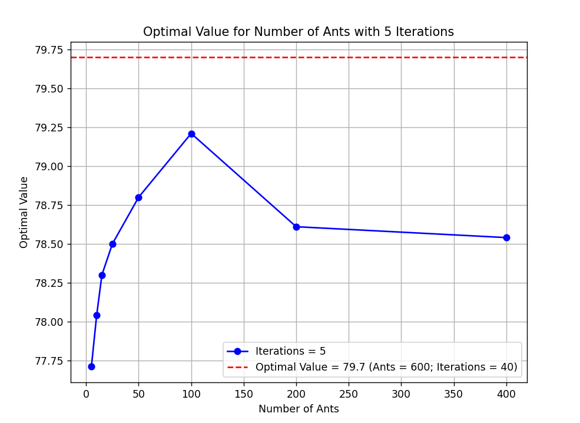

# Ant Colony Optimization Algorithm for Container Loading Problem with Wall-base Strategy

## Introduction

The **Container Loading Problem** (CLP) is a challenging optimization problem that focuses on efficiently loading goods into containers. In particular, the problem becomes significantly more complex when the goods are heterogeneous, meaning they vary in shape, size, and weight. Efficiently packing these items in a container while maximizing space utilization is crucial for minimizing transportation costs and optimizing logistics.

To solve this problem, we propose the use of the **Ant Colony Optimization (ACO)** algorithm, which is a nature-inspired optimization technique. ACO has been widely applied to various graph-based problems, including routing, assignment, and scheduling problems, due to its ability to find near-optimal solutions through a process of pheromone updating and path selection by artificial ants. The method has proven effective for solving complex combinatorial problems, including the CLP, where the goal is to find the optimal arrangement of goods to maximize the space utilization inside a container.

## Mathematical Modeling

### Objective Function

To evaluate the space utilization of the container, we use a metric called the **volume utilization ratio**, denoted as \( Z \). This ratio is defined as the ratio of the total volume of loaded goods to the available volume of the container:

<p align="center">
	
</p>

where \( l_i, w_i, h_i \) are the length, width, and height of the \( i \)-th item, respectively, and \( V \) is the total volume of the container.

### Constraints

1. The total volume of all loaded items must not exceed the volume of the container:

<p align="center">
	
</p>

2. The total weight of all loaded items must not exceed the weight capacity of the container:

<p align="center">
	
</p>

3. The center of gravity of the loaded goods must satisfy the following conditions for each direction of the three axes in the coordinate system:

<p align="center">
	
</p>

4. Each item must fit within the available space in the container, i.e., each dimension must not exceed the size of the corresponding subspace:

$$
\begin{cases}
0 < l_i \leq L_S \\
0 < w_i \leq W_S \\
0 < h_i \leq H_S
\end{cases}
$$

where \( [L_s, W_s, H_s] \) are the dimensions of the available subspace for item i (i in 1,2,...,N).

## Experimental Results

<p align="center">
	
</p>
 
When running the model on a dataset of 600 goods with varying sizes, and using initialization parameters such as: number of ants = 600, and number of iterations = 40, we obtained very positive results, as shown above, with an optimization rate of up to 79.69%.

Optimum value after 2 iterations:
<p align="center">
	
</p>

Optimum value after 5 iterations:
<p align="center">
	
</p>

## References
[1] Intelligent Loading of Scattered Cargoes Based on Improved Ant Colony Optimization | Zhisong Lin1*, Xiu Chen2 

## Installation
You can install the required libraries using pip:

```bash
pip install -r requirements.txt
```

## Cloning the Repository
To clone the repository, use the following command:

```bash
git clone https://github.com/tdattm/WB-ACO.git
```

## Running the Program
After cloning the repository and installing the required libraries, navigate to the project directory and run the script using Python:

```bash
cd WB-ACO
python main.py
```

## Contributing
Feel free to fork the repository and submit pull requests. Any improvements or enhancements are welcome!
